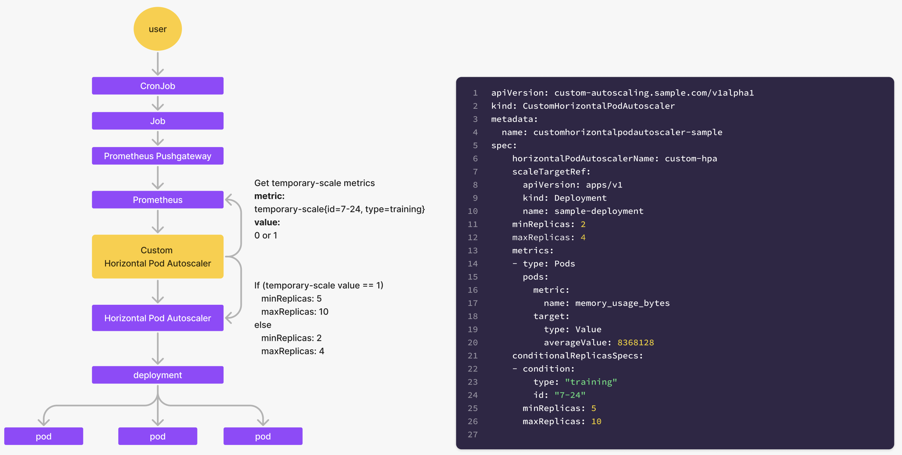

# custom-horizontal-pod-autoscaler


[](https://codecov.io/gh/TomoyukiSugiyama/custom-horizontal-pod-autoscaler)

Custom Horizontal Pod Autoscaler is an autoscaler that allows the minReplicas and maxReplicas of a [Horizontal Pod Autoscaler](https://kubernetes.io/docs/tasks/run-application/horizontal-pod-autoscale/) to be updated by Prometheus metrics. It is used when temporary scaling is required.

## Description

The user uses CronJob to add temporary scale metrics that output 0 (disabled) or 1 (enabled). The custom horizontal pod autoscaler retrieves metrics from the prometheus.

The custom horizontal pod autoscaler is set to minReplicas and maxReplicas, which are used when conditions are met. If the conditions are not met, the default minReplicas and maxReplicas will be in effect.



## Getting Started
You’ll need a Kubernetes cluster to run against. You can use [KIND](https://sigs.k8s.io/kind) to get a local cluster for testing, or run against a remote cluster.
**Note:** Your controller will automatically use the current context in your kubeconfig file (i.e. whatever cluster `kubectl cluster-info` shows).

### Running on the cluster
1. Install Instances of Custom Resources:

```sh
kustomize build config/samples | k apply -f -
```

2. Build and push your image to the location specified by `IMG`:

```sh
make docker-build docker-push IMG=<some-registry>/custom-horizontal-pod-autoscaler:tag
```

3. Deploy the controller to the cluster with the image specified by `IMG`:

```sh
make deploy IMG=<some-registry>/custom-horizontal-pod-autoscaler:tag
```

### Uninstall CRDs
To delete the CRDs from the cluster:

```sh
make uninstall
```

### Undeploy controller
UnDeploy the controller from the cluster:

```sh
make undeploy
```

### How it works
This project aims to follow the Kubernetes [Operator pattern](https://kubernetes.io/docs/concepts/extend-kubernetes/operator/).

It uses [Controllers](https://kubernetes.io/docs/concepts/architecture/controller/),
which provide a reconcile function responsible for synchronizing resources until the desired state is reached on the cluster.

### Test It Out
1. Install the CRDs into the cluster:

```sh
make install
```

2. Run your controller (this will run in the foreground, so switch to a new terminal if you want to leave it running):

```sh
make run
```

**NOTE:** You can also run this in one step by running: `make install run`

### Modifying the API definitions
If you are editing the API definitions, generate the manifests such as CRs or CRDs using:

```sh
make manifests
```

**NOTE:** Run `make --help` for more information on all potential `make` targets

More information can be found via the [Kubebuilder Documentation](https://book.kubebuilder.io/introduction.html)

## License

Copyright 2023 Tomoyuki Sugiyama.

Licensed under the Apache License, Version 2.0 (the "License");
you may not use this file except in compliance with the License.
You may obtain a copy of the License at

    http://www.apache.org/licenses/LICENSE-2.0

Unless required by applicable law or agreed to in writing, software
distributed under the License is distributed on an "AS IS" BASIS,
WITHOUT WARRANTIES OR CONDITIONS OF ANY KIND, either express or implied.
See the License for the specific language governing permissions and
limitations under the License.

