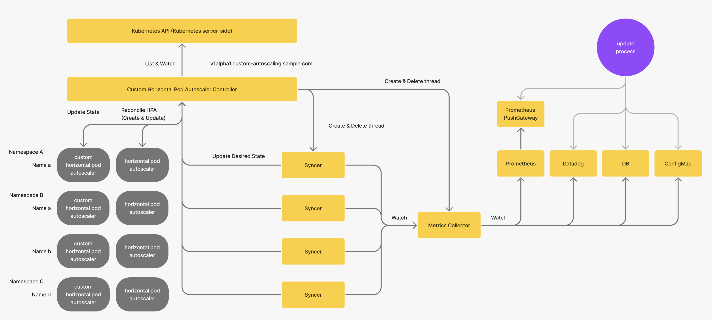

# architecture

The controller consists of the following elements.
* Custom Horizontal Pod Autoscaler: creates and updates HPAs
* Metrics Collector: collects metrics from Prometheus
* Syncer: Updates Desired State based on metrics

Currently, only Prometheus metrics are supported.
In the future, the configuration is designed to be easily supported by other systems besides Prometheus (Datadog, DB, ConfigMap).

# timing chart

The process runs in the following order.
1. When the Custom HPA Controller is started, the Metrics Collector is launched as a goroutine.
2. When the Custom HPA manifest is deployed, Syncer (which updates the HPA) is launched as a goroutine for each Namespace and Name.
3. Update the HPA's Desired State when manifest and metrics change.

